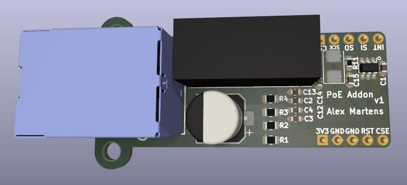

# PoE Addon

Simple board to add power over Ethernet to a project.

This uses the [Wiznet W5500] for TCP/IP offload, and a [Microchip 25AA02E48] for
a valid EUI-48 MAC address.

Proceed with caution, I have not made this yet due to part shortages.

## Bill of Materials

A bill of materials generated by [InteractiveHtmlBom] can be viewed at <https://newam.github.io/poe-addon/>

## Media

## Software Used

- [KiCad](http://kicad.org/) 7.0.0 release

[InteractiveHtmlBom]: https://github.com/openscopeproject/InteractiveHtmlBom/issues
[Wiznet W5500]: https://www.wiznet.io/product-item/w5500/
[Microchip 25AA02E48]: http://ww1.microchip.com/downloads/en/devicedoc/22123a.pdf
